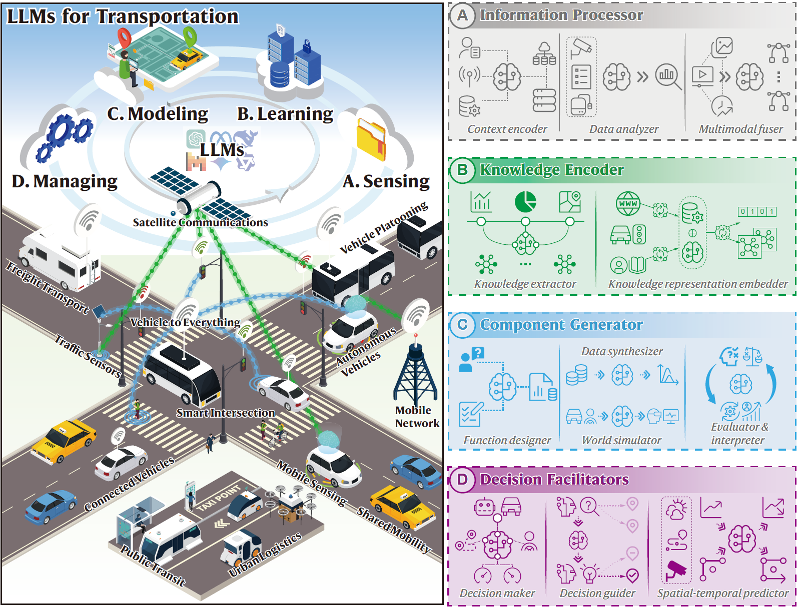
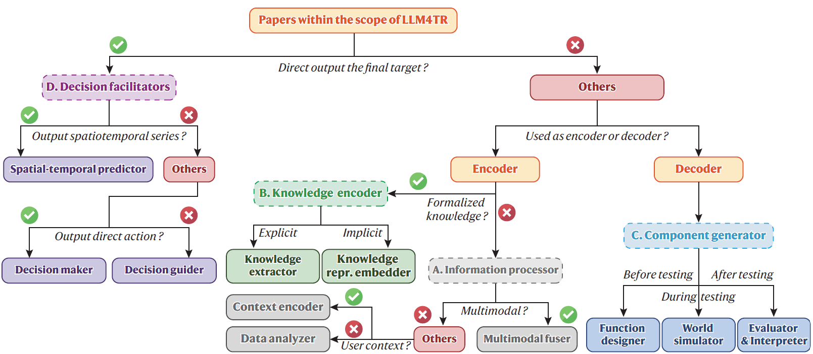
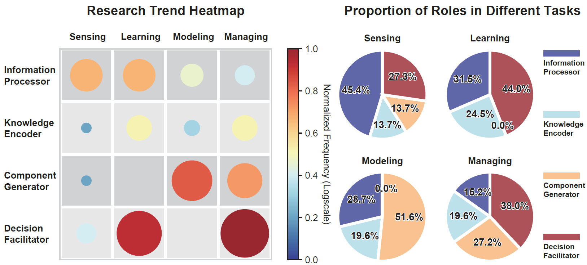

# Exploring the Roles of Large Language Models in Reshaping Transportation Systems: A Survey, Framework, and Roadmap

<div align="center">
<a href="https://arxiv.org/abs/2503.21411"></a>
<a href="https://github.com/tongnie/awesome-llm4tr/stargazers"></a>
</div>

<p align="center">

</p>

> A collection of papers and resources related to **Large Language Models for Transportation (LLM4TR)**. 
>
> This is the online content of our survey [**"Exploring the Roles of Large Language Models in Reshaping Transportation Systems: A Survey, Framework, and Roadmap"**]([https://arxiv.org/abs/2503.21411](https://arxiv.org/abs/2503.21411)). [](https://arxiv.org/abs/2503.21411)
>
> Feel free to contact us if you have any suggestions or would like to discuss with us by e-mail: tong.nie@connect.polyu.hk, wei.w.ma@polyu.edu.hk
>
>
> 🤝 If you find our survey or repository useful for your research, please cite the following paper:

```
@article{nie2025LLM4TR,
    title={Exploring the Roles of Large Language Models in Reshaping Transportation Systems: A Survey, Framework, and Roadmap},
    author={Tong Nie and Jian Sun and Wei Ma},
    year={2025},
    journal={arXiv preprint arXiv:2503.21411},
    url={https://arxiv.org/abs/2503.21411}
}
```

## :fire: Update
- [March 2025] ArXiv Version: Our paper has been released in arXiv!


## :page_with_curl: Framework and Taxonomy
*Definition*: LLM4TR refers to the methodological paradigm that systematically harnesses emergent capabilities of LLMs to enhance transportation tasks through four synergistic roles: transforming raw data into understandable insights, distilling domain-specific knowledge into computable structures, synthesizing adaptive system components, and orchestrating optimal decisions. We survey the existing literature and summarize how LLMs are exploited to solve transportation problems from a methodological perspective, i.e., **the roles of LLMs in transportation systems**. They generally include four aspects:

<p align="center">

</p>

- **LLMs as information processors**
    - *Function*: LLMs process and fuse heterogeneous transportation data from multiple sources (text, sensor data, task description, and user feedback) through contextual     encoding, analytical reasoning, and multimodal integration. They enable unified processing of complex traffic patterns, parsing and integrating multi-source information to assist in the managing and semantic understanding of traffic data, reducing the complexity of downstream tasks.
- **LLMs as knowledge encoders**
    - *Function*: LLMs extract and formalize transportation domain knowledge from unstructured data through explicit rule extraction and latent semantic embedding. This role bridges the gap between the unstructured domain knowledge inherent in the data and computable (or comprehensible) representations for downstream applications.
- **LLMs as component generators**
    - *Function*: LLMs create functional algorithms, synthetic environments, and evaluation frameworks through instruction-followed content generation. This role utilizes generative capabilities of LLMs to automate the design, testing, and refinement of components in intelligent transportation systems.
- **LLMs as decision facilitators**
    - *Function*: LLMs predict traffic dynamics, optimize decisions, and simulate human-like reasoning, establishing new paradigms as generalized task solvers. This role employs LLMs as predictive engines and decision facilitators for both micro-level agent behaviors and macro-level system states.

## 📈 Research trend
As an intuitive overview of the current research trend and focus, we visualize the statistics of selected papers according to our taxonomy.

<p align="center">

</p>
