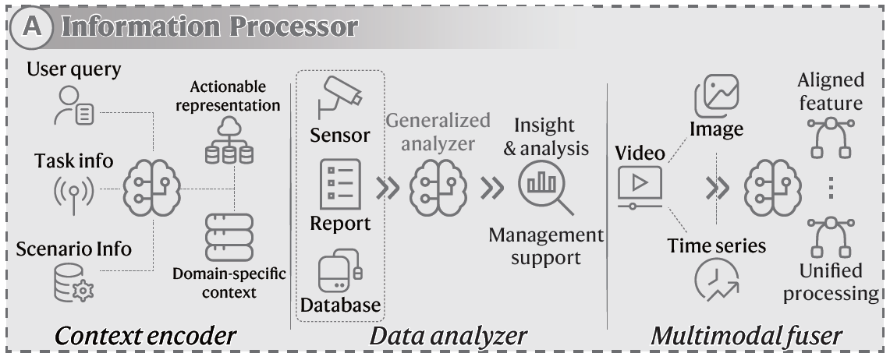
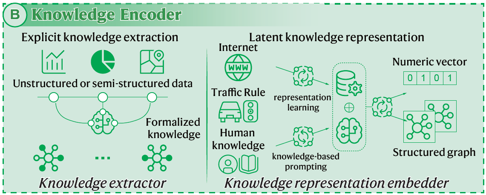
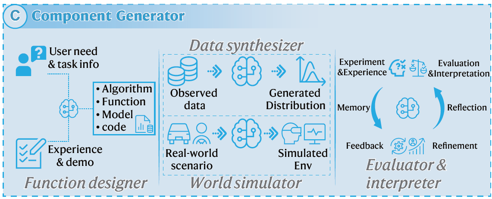
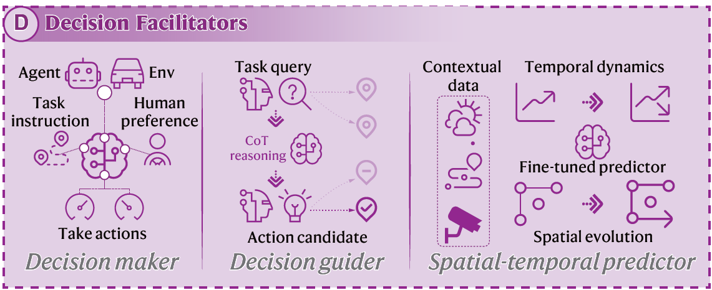

# Exploring the Roles of Large Language Models in Reshaping Transportation Systems: A Survey, Framework, and Roadmap

<div align="center">
<a href="https://doi.org/10.1016/j.ait.2025.100003"></a>
<a href="https://arxiv.org/abs/2503.21411"></a>
<a href="https://github.com/tongnie/awesome-llm4tr/stargazers"></a>
</div>


<p align="center">

</p>
<h5 align=center>The LLM4TR framework proposed in this survey.</h5>


> A curated collection of papers, datasets, and resources related to **Large Language Models for Transportation (LLM4TR)**. 
>
> This repository serves as the online companion to our survey [**"Exploring the Roles of Large Language Models in Reshaping Transportation Systems: A Survey, Framework, and Roadmap"**](https://doi.org/10.1016/j.ait.2025.100003), *Artificial Intelligence for Transportation (AIT), 1, 100003*. [](https://doi.org/10.1016/j.ait.2025.100003)
>
> 📢 The rapid advancement of Large Language Models (LLMs) is creating a paradigm shift in transportation research, moving from purely data-driven models to knowledge-infused intelligent systems. This repository aims to track the cutting-edge developments in this exciting field, serving as a hub for researchers, practitioners, and students. Stay tuned!
> 
> Feel free to contact us if you have any suggestions or would like to discuss with us by e-mail: tong.nie@connect.polyu.hk, wei.w.ma@polyu.edu.hk
>


## Table of Contents
- [🔥 News & Updates](#-news--updates)
- [📝 Cite Our Work](#-cite-our-work)
- [📖 Framework and Taxonomy](#-framework-and-taxonomy)
- [📚 Papers by Category](#-papers-by-category)
  - [LLMs as Information Processors](#llms-as-information-processors)
  - [LLMs as Knowledge Encoders](#llms-as-knowledge-encoders)
  - [LLMs as Component Generators](#llms-as-component-generators)
  - [LLMs as Decision Facilitators](#llms-as-decision-facilitators)
- [📈 Research Trend](#-research-trend)
- [⭐ Overview of Mainstream LLMs](#-overview-of-mainstream-llms)
- [💡 Foundational LLM Techniques](#-foundational-llm-techniques)
- [📋 Summary of Language-Enhanced Datasets](#-summary-of-language-enhanced-datasets)
- [📄 Representative Surveys on LLMs](#-representative-surveys-on-llms)
- [🛠️ Popular Open-Source Libraries for LLM Development](#️-popular-open-source-libraries-for-llm-development)
- [🖥️ Hardware Requirements for Fine-Tuning](#️-hardware-requirements-for-fine-tuning)
- [🌟 Awesome Lists and Resource Hubs](#-awesome-lists-and-resource-hubs)
- [🤝 How to Contribute](#-how-to-contribute)
- [License](#license)


## 🔥 News & Updates
- 🎉 **[June 2025] Official Publication!** Our survey has been published in the inaugural issue of ***Artificial Intelligence for Transportation (AIT)***, a new flagship journal led by the Chinese Overseas Transportation Association (COTA). As the **third paper** in its first volume (1, 100003), we are honored to contribute to this exciting new venue for AI in transportation research!
- ✅ **[March 2025] ArXiv Version:** Our survey is released on arXiv!
- ✅ **[March 2025] Repository Launch:** The `awesome-llm4tr` repository is initialized.

## 📝 Cite Our Work
If you find our survey or this repository useful for your research, please cite our paper:
```bibtex
@article{nie2025exploring,
  title={Exploring the roles of large language models in reshaping transportation systems: A survey, framework, and roadmap},
  author={Nie, Tong and Sun, Jian and Ma, Wei},
  journal={Artificial Intelligence for Transportation},
  volume={1},
  pages={100003},
  year={2025},
  publisher={Elsevier},
  doi={10.1016/j.ait.2025.100003}
}
```

## 📖 Framework and Taxonomy
*Definition*: **LLM4TR** refers to the methodological paradigm that systematically harnesses emergent capabilities of LLMs to enhance transportation tasks through four synergistic roles: transforming raw data into understandable insights, distilling domain-specific knowledge into computable structures, synthesizing adaptive system components, and orchestrating optimal decisions. We survey the existing literature and summarize how LLMs are exploited to solve transportation problems from a methodological perspective, i.e., the roles of LLMs in transportation systems. They generally include four aspects:

<p align="center">

</p>
<h5 align=center>The literature classification procedure in this survey.</h5>

---

## 📚 Papers by Category
Here, we list representative papers according to the four roles defined in the LLM4TR framework. (Placeholders `[link]`, `[code]`, `[project]` to fill in).

#### **LLMs as Information Processors**
*Function: Process and fuse heterogeneous transportation data from multiple sources (text, sensor data, user feedback) through contextual encoding, analytical reasoning, and multimodal integration.*


<p align="center">

</p>
<h5 align=center>LLMs as Information Processors.</h5>


- **Context Encoder**
    - **[TP-GPT: Real-time data informed intelligent chatbot for transportation surveillance and management]([link])**. *Wang, B. et al.* **[arXiv 2024]**. `[project]`
        - *Highlight: Generates SQL queries and natural language interpretations for large-scale traffic databases.*
    - **[ChatSUMO: Large language model for automating traffic scenario generation in simulation of urban mobility]([link])**. *Li, S. et al.* **[T-IV 2024]**. `[code]`
        - *Highlight: Enables non-experts to create SUMO traffic simulations using natural language commands.*
    - **[ChatScene: Knowledge-enabled safety-critical scenario generation for autonomous vehicles]([link])**. *Zhang, J. et al.* **[CVPR 2024]**. `[project]`
        - *Highlight: Utilizes LLMs to decompose unstructured language into detailed, safety-critical driving scenarios for simulation.*
    - **[Can you text what is happening? Integrating pre-trained language encoders into trajectory prediction models for autonomous driving]([link])**. *Keysan, A. et al.* **[arXiv 2023]**.
        - *Highlight: Employs BERT to encode textual scene descriptions, enhancing trajectory prediction models.*
    - **[Video-to-text pedestrian monitoring (VTPM): Leveraging computer vision and large language models for privacy-preserve pedestrian activity monitoring at intersections]([link])**. *Abdelrahman, A. S. et al.* **[arXiv 2024]**.
        - *Highlight: Converts raw video feeds into anonymized text descriptors for real-time pedestrian behavior prediction while preserving privacy.*

- **Data Analyzer**
    - **[CrashLLM: Learning traffic crashes as language: Datasets, benchmarks, and what-if causal analyses]([link])**. *Fan, Z. et al.* **[arXiv 2024]**. `[project]`
        - *Highlight: Fine-tunes LLMs to predict crash outcomes and analyze contributing factors from textual crash reports.*
    - **[TrafficGPT: Viewing, processing and interacting with traffic foundation models]([link])**. *Zhang, S. et al.* **[Transport Policy 2024]**. `[project]`
        - *Highlight: Demonstrates the zero-shot analytical capabilities of LLMs for traffic data analysis and management support.*
    - **[Large language models in analyzing crash narratives—a comparative study of chatGPT, BARD and GPT-4]([link])**. *Mumtarin, M. et al.* **[arXiv 2023]**.
        - *Highlight: Evaluates the ability of various LLMs to extract information and answer questions from textual crash narratives.*
    - **[A large language model framework to uncover underreporting in traffic crashes]([link])**. *Arteaga, C. & Park, J.* **[J. Safety Res. 2025]**.
        - *Highlight: Uses LLMs with iterative prompt engineering to parse unstructured crash reports and identify underreported alcohol involvement.*

- **Multimodal Fuser**
    - **[SeeUnsafe: When language and vision meet road safety: leveraging multimodal large language models for video-based traffic accident analysis]([link])**. *Zhang, R. et al.* **[arXiv 2025]**. `[project]`
        - *Highlight: An interactive framework where an MLLM classifies accidents, grounds visual elements, and generates structured reports from video.*
    - **[RAG-Driver: Generalisable driving explanations with retrieval-augmented in-context learning in multi-modal large language model]([link])**. *Yuan, J. et al.* **[arXiv 2024]**. `[code]`
        - *Highlight: Integrates a retrieval mechanism to provide expert demonstrations, improving the generation of human-readable driving actions.*
    - **[Using multimodal large language models (MLLMs) for automated detection of traffic safety-critical events]([link])**. *Abu Tami, M. et al.* **[Vehicles 2024]**.
        - *Highlight: Employs Gemini-Pro-Vision and LLaVa to detect safety-critical events by fusing textual, visual, and audio inputs.*
    - **[On the road with GPT-4V(ision): Early explorations of visual-language model on autonomous driving]([link])**. *Wen, L. et al.* **[arXiv 2023]**. `[project]`
        - *Highlight: A foundational exploration of GPT-4V's capabilities in various autonomous driving scenarios, showcasing its potential and limitations.*
    - **[Enhancing vision-language models with scene graphs for traffic accident understanding]([link])**. *Lohner, A. et al.* **[IAVVC 2024]**.
        - *Highlight: Improves VLM understanding of complex traffic events by incorporating scene graphs to represent relationships between objects.*

#### **LLMs as Knowledge Encoders**
*Function: Extract and formalize transportation domain knowledge from unstructured data through explicit rule extraction and latent semantic embedding.*

<p align="center">

</p>
<h5 align=center>LLMs as Knowledge Encoders.</h5>


- **Knowledge Extractor**
    - **[TransGPT: Multi-modal generative pre-trained transformer for transportation]([link])**. *Wang, P. et al.* **[arXiv 2024]**. `[project]`
        - *Highlight: A specialized LLM fine-tuned on transportation datasets to serve as a domain-specific knowledge base.*
    - **[TrafficSafetyGPT: Tuning a pre-trained large language model to a domain-specific expert in transportation safety]([link])**. *Zheng, O. et al.* **[arXiv 2023]**. `[code]`
        - *Highlight: Grounds LLMs in safety-critical contexts by fine-tuning on a curated corpus of official guidebooks and generated instructions.*
    - **[TARGET: Automated scenario generation from traffic rules for testing autonomous vehicles]([link])**. *Deng, Y. et al.* **[arXiv 2023]**. `[code]`
        - *Highlight: Employs LLMs to parse natural language traffic rules and generate formal, executable test scenarios for simulators.*
    - **[IncidentResponseGPT: Generating traffic incident response plans with generative artificial intelligence]([link])**. *Grigorev, A. et al.* **[arXiv 2024]**.
        - *Highlight: Uses LLMs to synthesize regional guidelines and real-time data into structured, actionable incident response plans.*
    - **[Harnessing multimodal large language models for traffic knowledge graph generation and decision-making]([link])**. *Kuang, S. et al.* **[Commun. Transp. Res. 2024]**.
        - *Highlight: Extracts common traffic knowledge from scene images using a VLM to generate visual traffic knowledge graphs.*

- **Knowledge Representation Embedder**
    - **[Geolocation representation from large language models are generic enhancers for spatio-temporal learning]([link])**. *He, J. et al.* **[arXiv 2024]**. `[code]`
        - *Highlight: Elicits inherent geospatial knowledge from pretrained LLMs to create continuous vector representations of locations for downstream tasks.*
    - **[LCT-Gen: Language conditioned traffic generation]([link])**. *Tan, S. et al.* **[arXiv 2023]**. `[code]`
        - *Highlight: Converts textual descriptions into structured scene vectors to condition a Transformer model for realistic traffic behavior generation.*
    - **[ALT-Pilot: Autonomous navigation with language augmented topometric maps]([link])**. *Omama, M. et al.* **[arXiv 2023]**. `[project]`
        - *Highlight: Uses LLMs to generate embeddings of language-based landmarks, enhancing vehicle localization in unmapped environments.*
    - **[Large language models powered context-aware motion prediction]([link])**. *Zheng, X. et al.* **[arXiv 2024]**.
        - *Highlight: Integrates GPT-4V-derived embeddings as "Transportation Context Maps" to improve motion forecasting.*
    - **[Classifying pedestrian maneuver types using the advanced language model]([link])**. *Das, S. et al.* **[TRR 2023]**.
        - *Highlight: Applies a fine-tuned BERT model to classify pedestrian maneuvers from unstructured police crash narratives based on text embeddings.*

#### **LLMs as Component Generators**
*Function: Create functional algorithms, synthetic environments, and evaluation frameworks through instruction-followed content generation.*

<p align="center">

</p>
<h5 align=center>LLMs as Component Generators.</h5>


- **Function Designer**
    - **[AutoReward: Closed-loop reward design with large language models for autonomous driving]([link])**. *Han, X. et al.* **[T-IV 2024]**. `[code]`
        - *Highlight: Automates the design of reward functions for RL-based autonomous driving using concrete linguistic goals.*
    - **[Large language model-enhanced reinforcement learning for generic bus holding control strategies]([link])**. *Yu, J. et al.* **[arXiv 2024]**. `[code]`
        - *Highlight: Leverages LLMs to automate reward function design for RL-based public transit control through a multi-module framework.*
    - **[Eureka: Human-level reward design via coding large language models]([link])**. *Ma, Y.J. et al.* **[arXiv 2023]**. `[project]`
        - *Highlight: A seminal work on using LLMs to write reward functions for complex RL tasks, demonstrating human-level performance.*
    - **[Can chatgpt enable its? The case of mixed traffic control via reinforcement learning]([link])**. *Villarreal, M. et al.* **[ITSC 2023]**.
        - *Highlight: Investigates the use of ChatGPT to help non-experts design RL policies for mixed traffic control, improving user success rates.*

- **World Simulator**
    - **[MagicDrive: Street view generation with diverse 3D geometry control]([link])**. *Gao, R. et al.* **[arXiv 2023]**. `[project]`
        - *Highlight: A pioneering generative model for creating high-fidelity, controllable street-view images and videos from various signals.*
    - **[DriveDreamer-2: LLM-enhanced world models for diverse driving video generation]([link])**. *Zhao, G. et al.* **[arXiv 2024]**. `[project]`
        - *Highlight: Integrates an LLM interface to convert user queries into agent trajectories, generating customized HD maps and driving videos.*
    - **[GAIA-1: A generative world model for autonomous driving]([link])**. *Hu, A. et al.* **[arXiv 2023]**. `[project]`
        - *Highlight: A world model that can generate realistic driving scenarios from video and action inputs, used for closed-loop simulation.*
    - **[DriveMM: All-in-one large multimodal model for autonomous driving]([link])**. *Huang, Z. et al.* **[arXiv 2024]**.
        - *Highlight: Synthesizes heterogeneous sensor inputs to simulate dynamic driving environments and generate actionable outputs.*

- **Evaluator & Interpreter**
    - **[CRITICAL: Enhancing autonomous vehicle training with language model integration and critical scenario generation]([link])**. *Tian, H. et al.* **[arXiv 2024]**. `[project]`
        - *Highlight: A framework that uses LLMs to interpret RL training episodes, evaluate failure patterns, and generate critical scenarios for self-refinement.*
    - **[iLLM-TSC: Integration reinforcement learning and large language model for traffic signal control policy improvement]([link])**. *Pang, A. et al.* **[arXiv 2024]**. `[code]`
        - *Highlight: An LLM acts as a corrective layer to evaluate and refine decisions made by an RL agent for traffic signal control.*
    - **[DrPlanner: Diagnosis and repair of motion planners for automated vehicles using large language models]([link])**. *Lin, Y. et al.* **[RAL 2024]**.
        - *Highlight: Uses LLMs to provide feedback and suggest refinements for both rule-based and optimization-based driving policies.*

#### **LLMs as Decision Facilitators**
*Function: Predict traffic dynamics, optimize decisions, and simulate human-like reasoning, establishing new paradigms as generalized task solvers.*


<p align="center">

</p>
<h5 align=center>LLMs as Decision Facilitators.</h5>


- **Decision Maker**
    - **[LLMLight: Large language models as traffic signal control agents: Capacity and opportunity]([link])**. *Lai, S. et al.* **[arXiv 2023]**. `[code]`
        - *Highlight: A pioneering work that employs GPT models as intuitive, human-like decision-makers for traffic light optimization.*
    - **[DriveLM: Driving with graph visual question answering]([link])**. *Sima, C. et al.* **[ECCV 2024]**. `[project]`
        - *Highlight: Structures scene understanding as Graph Visual Question Answering, enabling multi-step reasoning for autonomous driving decisions.*
    - **[DriveGPT4: Interpretable end-to-end autonomous driving via large language model]([link])**. *Xu, Z. et al.* **[RAL 2024]**. `[project]`
        - *Highlight: An end-to-end framework that processes video and text queries to directly predict control signals while providing rationale.*
    - **[GPT-Driver: Learning to drive with gpt]([link])**. *Mao, J. et al.* **[arXiv 2023]**.
        - *Highlight: Reformulates motion planning as a language modeling problem, representing inputs and outputs as language tokens.*
    - **[COMAL: Collaborative multi-agent large language models for mixed-autonomy traffic]([link])**. *Yao, H. et al.* **[arXiv 2024]**. `[project]`
        - *Highlight: Integrates multiple LLM agents to optimize traffic flow in mixed-autonomy settings through collaborative communication.*

- **Decision Guider**
    - **[AccidentGPT: Accident analysis and prevention from V2X environmental perception with multi-modal large model]([link])**. *Wang, L. et al.* **[arXiv 2023]**. `[code]`
        - *Highlight: A multimodal safety advisor that anticipates accidents and issues dialogue-based contextual recommendations.*
    - **[LanguageMPC: Large language models as decision makers for autonomous driving]([link])**. *Sha, H. et al.* **[arXiv 2023]**. `[code]`
        - *Highlight: Uses an LLM as a high-level planner to reason about traffic scenarios and adjust the priorities of a low-level Model Predictive Control system.*
    - **[ChatGPT as your vehicle Co-pilot: An initial attempt]([link])**. *Wang, S. et al.* **[T-IV 2023]**.
        - *Highlight: Embeds ChatGPT as a vehicle co-pilot that translates natural language commands into domain-specific actions and trajectory plans.*

- **Spatial-Temporal Predictor**
    - **[TPLLM: A traffic prediction framework based on pretrained large language models]([link])**. *Ren, Y. et al.* **[arXiv 2024]**. `[code]`
        - *Highlight: Introduces a LoRA fine-tuning approach for GPT-2 to perform traffic prediction efficiently.*
    - **[ST-LLM: Spatial-temporal large language model for traffic prediction]([link])**. *Liu, C. et al.* **[arXiv 2024]**. `[code]`
        - *Highlight: Adopts a GPT-like architecture with a unified spatial-temporal embedding module for traffic forecasting.*
    - **[MobilityGPT: Enhanced human mobility modeling with a GPT model]([link])**. *Haydari, A. et al.* **[arXiv 2024]**.
        - *Highlight: Formulates human mobility modeling as an autoregressive generation task and fine-tunes it using Reinforcement Learning from Trajectory Feedback (RLTF).*
    - **[Large language models are zero-shot time series forecasters]([link])**. *Gruver, N. et al.* **[NeurIPS 2023]**.
        - *Highlight: A foundational paper demonstrating that pretrained LLMs can perform zero-shot time series forecasting surprisingly well.*
    - **[UniTraj: Universal human trajectory modeling from billion-scale worldwide traces]([link])**. *Zhu, Y. et al.* **[arXiv 2024]**.
        - *Highlight: Proposes a universal model for human mobility that unifies individual trajectory and crowd flow prediction paradigms.*


---
## 📈 Research Trend
An overview of the current research trends, visualized according to our taxonomy.

<p align="center">

</p>
<h5 align=center>Heatmap of the current research trend and pie chart of the proportion of the four roles of LLMs in different tasks.</h5>


---
## ⭐ Overview of Mainstream LLMs
| **Model**                        | **Release Date**    | **Organization** | **Size (B)**   | **Data (TB)**  | **Hardware Cost**    | **Public Access** |
|---------------------------------------|---------------------|-----------------------|-----------------|----------------|----------------------|-----------------|
| [T5](https://github.com/google-research/text-to-text-transfer-transformer)      | 2019.10             | Google                | 11              | 750 GB of text | 1024 TPU v3          | Yes             |
| GPT-3     | 2020.5              | OpenAI                | 175             | 300 B tokens   | -                    | No              |
| PaLM       | 2022.4              | Google                | 540             | 780 B tokens   | 6144 TPU v4          | No              |
| [LLaMA](https://github.com/facebookresearch/llama)         | 2023.2              | Meta                  | 65              | 1.4 T tokens   | 2048    A100 GPU   |       Partial  |
| GPT-4           | 2023.3              | OpenAI                | -               | -              | -                    | No              |
| [LLaMA-2](https://ai.meta.com/llama/)      | 2023.7              | Meta                  | 70              | 2 T tokens     | 2000    A100 GPU              | Yes                 |
| [Mistral-7B](https://mistral.ai/news/announcing-mistral-7b/) | 2023.9              | Mistral AI            | 7               | -              | -                    | Yes             |
| [Qwen-72B](https://github.com/QwenLM/Qwen)          | 2023.11             | Alibaba               | 72              | 3 T tokens     | -                    | Yes             |
| [Grok-1](https://github.com/xai-org/grok-1)                                | 2024.3              | xAI                   | 314             | -              | -                    | Yes             |
| Claude 3                              | 2024.3              | Anthropic             | -               | -              | -                    | No              |
| [ChatGLM-4](https://github.com/THUDM/ChatGLM-4)        | 2024.6              | Zhipu AI              | 9               | 10 T tokens    | -                    | Yes             |
| [LLaMA-3.1](https://ai.meta.com/blog/meta-llama-3-1/)       | 2024.7              | Meta                  | 405             | 15 T tokens    | 16k H100 GPU | Yes             |
| [Gemma-2](https://ai.google.dev/gemma/docs/gemma2)         | 2024.6              | Google                | 27              | 13 T tokens    | 6144 TPUv5p          | Yes             |
| [DeepSeek-V2](https://github.com/deepseek-ai/DeepSeek-V2)    | 2024.12             | DeepSeek              | 671 (MoE) | 14.8 T tokens  | 2048 H800 GPU        | Yes             |


---
## 💡 Foundational LLM Techniques
> This section lists core papers on the foundational techniques of LLMs, providing essential context for their application in transportation. It is designed to be a comprehensive resource for understanding *how* LLMs work. This list is inspired by and integrated with resources from the excellent [**RUCAIBox/LLMSurvey**](https://github.com/RUCAIBox/LLMSurvey).

#### 1. Core Architectures & Concepts
- **[Attention Is All You Need](https://arxiv.org/abs/1706.03762)**. *Vaswani, A. et al.* **[NeurIPS 2017]**.
    - *Highlight: Introduced the **Transformer**, the fundamental architecture based on self-attention that underpins nearly all modern LLMs.*
- **[Scaling Laws for Neural Language Models](https://arxiv.org/abs/2001.08361)**. *Kaplan, J. et al.* **[arXiv 2020]**.
    - *Highlight: Established the predictable, power-law relationship between model performance, model size, dataset size, and compute, justifying the "bigger is better" paradigm.*
- **[Switch Transformers: Scaling to Trillion Parameter Models with Simple and Efficient Sparsity](https://arxiv.org/abs/2101.03961)**. *Fedus, W. et al.* **[JMLR 2022]**.
    - *Highlight: Introduced the **Mixture of Experts (MoE)** layer as an effective way to massively scale model parameters without a proportional increase in computational cost.*

#### 2. Seminal Pre-trained Models
- **[Improving Language Understanding by Generative Pre-Training](https://cdn.openai.com/research-covers/language-unsupervised/language_understanding_paper.pdf)**. *Radford, A. et al.* **[OpenAI Tech Report 2018]**.
    - *Highlight: The original **GPT-1**, which demonstrated the effectiveness of generative pre-training for downstream NLP tasks.*
- **[BERT: Pre-training of Deep Bidirectional Transformers for Language Understanding](https://arxiv.org/abs/1810.04805)**. *Devlin, J. et al.* **[NAACL 2019]**.
    - *Highlight: Pioneered bidirectional pre-training (autoencoding) using Masked Language Modeling (MLM), which led to a significant leap in performance on understanding-based tasks.*
- **[Language Models are Unsupervised Multitask Learners](https://d4mucfpksywv.cloudfront.net/better-language-models/language_models_are_unsupervised_multitask_learners.pdf)**. *Radford, A. et al.* **[OpenAI Blog 2019]**.
    - *Highlight: Introduced **GPT-2** and showcased its impressive zero-shot learning capabilities, proving that large models could perform tasks they were not explicitly trained for.*
- **[Exploring the Limits of Transfer Learning with a Unified Text-to-Text Transformer](https://arxiv.org/abs/1910.10683)**. *Raffel, C. et al.* **[JMLR 2020]**.
    - *Highlight: Introduced **T5**, which framed every NLP task as a text-to-text problem, creating a versatile and powerful framework.*
- **[Language Models are Few-Shot Learners](https://arxiv.org/abs/2005.14165)**. *Brown, T. et al.* **[NeurIPS 2020]**.
    - *Highlight: Introduced **GPT-3** and popularized **in-context learning**, showing that massive scale (175B parameters) unlocks emergent abilities without gradient updates.*

#### 3. Instruction Tuning & Alignment
- **[Finetuned Language Models Are Zero-Shot Learners](https://arxiv.org/abs/2109.01652)**. *Wei, J. et al.* **[ICLR 2022]**.
    - *Highlight: The predecessor to Flan, showing that fine-tuning on a collection of NLP tasks (a form of **Supervised Fine-Tuning, SFT**) dramatically improves zero-shot performance on unseen tasks.*
- **[Training language models to follow instructions with human feedback](https://arxiv.org/abs/2203.02155)**. *Ouyang, L. et al.* **[NeurIPS 2022]**.
    - *Highlight: The core paper behind InstructGPT (the basis for ChatGPT), detailing **Reinforcement Learning from Human Feedback (RLHF)** to align models with user intent.*
- **[Constitutional AI: Harmlessness from AI Feedback](https://arxiv.org/abs/2212.08073)**. *Bai, Y. et al.* **[arXiv 2022]**.
    - *Highlight: Proposed a method for training a harmless AI assistant without human labels by having the model critique and revise its own responses based on a given "constitution."*
- **[Direct Preference Optimization: Your Language Model is Secretly a Reward Model](https://arxiv.org/abs/2305.18290)**. *Rafailov, R. et al.* **[NeurIPS 2023]**.
    - *Highlight: Introduced **DPO**, a simpler and more stable alternative to RLHF that extracts a reward model directly from preference data and fine-tunes the policy in a single stage.*

#### 4. Parameter-Efficient Fine-Tuning (PEFT)
- **[Parameter-Efficient Transfer Learning for NLP](https://arxiv.org/abs/1902.00751)**. *Houlsby, N. et al.* **[ICML 2019]**.
    - *Highlight: Introduced **Adapter Tuning**, where small, trainable modules are inserted between Transformer layers, freezing the rest of the model.*
- **[Prefix-Tuning: Optimizing Continuous Prompts for Generation](https://arxiv.org/abs/2101.00190)**. *Li, X.L. & Liang, P.* **[ACL 2021]**.
    - *Highlight: Proposed learning a small, continuous task-specific vector (prefix) that is prepended to the model's internal states, an early and influential PEFT method.*
- **[The Power of Scale for Parameter-Efficient Prompt Tuning](https://arxiv.org/abs/2104.08691)**. *Lester, B. et al.* **[EMNLP 2021]**.
    - *Highlight: Simplified Prefix-Tuning by learning "soft prompts" only at the input layer, showing it becomes competitive with full fine-tuning at sufficient scale.*
- **[LoRA: Low-Rank Adaptation of Large Language Models](https://arxiv.org/abs/2106.09685)**. *Hu, E.J. et al.* **[ICLR 2022]**.
    - *Highlight: Introduced a highly popular and effective PEFT method by adapting only low-rank matrices of the weight updates, making fine-tuning much more memory-efficient.*

#### 5. Advanced Reasoning & Prompting
- **[Chain-of-Thought Prompting Elicits Reasoning in Large Language Models](https://arxiv.org/abs/2201.11903)**. *Wei, J. et al.* **[NeurIPS 2022]**.
    - *Highlight: A groundbreaking discovery that simply prompting LLMs with "Let's think step by step" (**Zero-shot CoT**) or providing few-shot exemplars with reasoning steps unlocks complex reasoning abilities.*
- **[Self-Consistency Improves Chain of Thought Reasoning in Language Models](https://arxiv.org/abs/2203.11171)**. *Wang, X. et al.* **[ICLR 2023]**.
    - *Highlight: An enhancement to CoT where multiple reasoning paths are sampled, and the most consistent answer is chosen by majority vote, improving robustness.*
- **[ReAct: Synergizing Reasoning and Acting in Language Models](https://arxiv.org/abs/2210.03629)**. *Yao, S. et al.* **[ICLR 2023]**.
    - *Highlight: A foundational paradigm for agents where the LLM interleaves **Rea**soning (thought) traces and **Act**ions (e.g., tool use), enabling dynamic interaction with external environments.*
- **[Tree of Thoughts: Deliberate Problem Solving with Large Language Models](https://arxiv.org/abs/2305.10601)**. *Yao, S. et al.* **[NeurIPS 2023]**.
    - *Highlight: Generalizes Chain-of-Thought by allowing LLMs to explore multiple reasoning paths in a tree structure, performing deliberate search and lookahead.*

#### 6. Integrating External Knowledge & Tools
- **[Retrieval-Augmented Generation for Knowledge-Intensive NLP Tasks](https://arxiv.org/abs/2005.11401)**. *Lewis, P. et al.* **[NeurIPS 2020]**.
    - *Highlight: The original **RAG** paper, which proposed combining a pre-trained language model with a non-parametric memory (a retriever) to ground responses in external knowledge.*
- **[Toolformer: Language Models Can Teach Themselves to Use Tools](https://arxiv.org/abs/2302.04761)**. *Schick, T. et al.* **[NeurIPS 2023]**.
    - *Highlight: A framework where an LLM learns to use external tools (e.g., calculators, search engines) by teaching itself to generate API calls during pre-training.*

#### 7. Efficiency & Optimization
- **[QLoRA: Efficient Finetuning of Quantized LLMs](https://arxiv.org/abs/2305.14314)**. *Dettmers, T. et al.* **[NeurIPS 2023]**.
    - *Highlight: A breakthrough technique that enables fine-tuning massive models on a single GPU by quantizing the base model to 4-bit and using LoRA on top.*
- **[Fast Decoding from Language Models with Speculative Sampling](https://arxiv.org/abs/2211.17192)**. *Leviathan, Y. et al.* **[ICML 2023]**.
    - *Highlight: Introduced **Speculative Decoding**, a popular method to accelerate inference by using a small, fast draft model to generate token sequences that are then verified by the large model.*

#### 8. Key Evaluation Benchmarks
- **[Measuring Massive Multitask Language Understanding](https://arxiv.org/abs/2009.03300)**. *Hendrycks, D. et al.* **[ICLR 2021]**.
    - *Highlight: Introduced **MMLU**, one of the most widely used benchmarks for evaluating the world knowledge and problem-solving abilities of LLMs across a wide range of subjects.*
- **[Beyond the Imitation Game: Quantifying and extrapolating the capabilities of language models](https://arxiv.org/abs/2206.04615)**. *Srivastava, A. et al.* **[TMLR 2023]**.
    - *Highlight: Introduced **BIG-bench**, a massive collaborative benchmark of over 200 tasks designed to probe for emergent abilities and future capabilities of language models.*


---
## 📋 Summary of Language-Enhanced Datasets
Here is an expanded list of datasets and benchmarks, with new entries integrated from the [Awesome-VLM-AD-ITS](https://github.com/ge25nab/Awesome-VLM-AD-ITS) repository.

| **Dataset**                                             | **Year** | **Venue** | **Task**                                                                                      | **Use Case in LLM Development**                                                  |
|:-------------------------------------------------------------|:--------:|:---------:|:--------------------------------------------------------------------------------------------------|:--------------------------------------------------------------------------------------|
| [KITTI](https://www.cvlibs.net/datasets/kitti/) | 2012 | CVPR | 3D object detection, tracking, stereo, and visual odometry | Foundational benchmark for classic perception tasks in autonomous driving. |
| [Waymo Open Dataset](https://waymo.com/open/) | 2019 | CVPR | Perception (detection, tracking) and motion prediction | Large-scale, high-resolution sensor data for training and evaluating AD models. |
| [BDD-X](https://github.com/JinkyuKimUCB/BDD-X-dataset)                                | 2018     | ECCV      | Action interpretation and control signal prediction                                                | Explainable end-to-end driving through visual question answering.                     |
| [SUTD-TrafficQA](https://github.com/sutdcv/SUTD-TrafficQA)                           | 2021     | CVPR      | Video causal reasoning over traffic events                                                         | Evaluating the reasoning capability over 6 tasks.                                     |
| [Argoverse 2](https://www.argoverse.org/av2.html) | 2023 | CVPR | Motion forecasting, lidar object detection | Contains sensor data and HD maps with a focus on prediction and forecasting tasks. |
| [TrafficSafety-2K](https://github.com/ozheng1993/TrafficSafetyGPT?tab=readme-ov-file)       | 2023     | arXiv     | Annotated traffic incident and crash report analysis                                               | GPT fine-tuning for safety situational awareness.                                     |
| [NuPrompt](https://github.com/wudongming97/Prompt4Driving?tab=readme-ov-file)                              | 2023     | AAAI      | Object-centric language prompt set for 3D driving scenes                                           | Prompt-based driving task to predict the described object trajectory.                 |
| [Talk2Car](https://github.com/talk2car/Talk2Car) | 2019 | ICCV | Referring object localization via natural language | Grounding language commands to objects in a visual scene for human-vehicle interaction. |
| [LaMPilot](https://github.com/PurdueDigitalTwin/LaMPilot)                               | 2024     | CVPR      | Code generation for autonomous driving decisions                                                   | CoT reasoning and instruction following for lane changes and speed adaptation.        |
| [CoVLA](https://huggingface.co/datasets/turing-motors/CoVLA-Dataset)                                  | 2024     | arXiv     | Vision-Language-Action alignment (80+ hrs driving videos)                                          | Trajectory planning with natural language maneuver descriptions.                      |
| [VLAAD](https://github.com/sungyeonparkk/vision-assistant-for-driving)                                  | 2024     | WACV      | Natural language description of driving scenarios                                                  | QA systems for driving situation understanding.                                       |
| [CrashLLM](https://crashllm.github.io/)                            | 2024     | arXiv     | Crash outcome prediction (severity, injuries)                                                      | What-if causal analysis for traffic safety using 19k crash reports.                   |
| [TransportBench](https://agi4engineering.github.io/TransportBench/)                  | 2024     | arXiv     | Answering undergraduate-level transportation engineering problem                                   | Benchmarking LLMs on planning, design, management, and control questions.             |
| [Driving QA](https://github.com/wayveai/Driving-with-LLMs)                           | 2024     | ICRA      | 160k driving QA pairs with control commands                                                        | Interpreting scenarios, answering questions, and decision-making.                     |
| [MAPLM](https://github.com/LLVM-AD/MAPLM)                                   | 2024     | CVPR      | Multimodal traffic scene dataset including context, image, point cloud, and HD map                 | Visual instruction-tuning LLMs and VLMs and vision QA tasks.                          |
| [DrivingDojo](https://github.com/Robertwyq/Drivingdojo)                     | 2024     | NeurIPS   | Video clips with maneuvers, multi-agent interplay, and driving knowledge | Training and action instruction following benchmark for driving world models. |
| [TransportationGames](https://arxiv.org/abs/2401.04471)   | 2024     | arXiv     | Benchmarks of LLMs in memorizing, understanding, and applying transportation knowledge | Grounding (M)LLMs in transportation-related tasks.                                    |
| [NuScenes-QA](https://github.com/qiantianwen/NuScenes-QA)                         | 2024     | AAAI      | Benchmark for vision QA in autonomous driving, with 34K visual scenes and 460K QA pairs       | Developing 3D detection and VQA techniques for end-to-end autonomous driving systems. |
| [TUMTraffic-VideoQA](https://traffix-videoqa.github.io/)                | 2025     | arXiv     | Temporal traffic video understanding                                                               | Benchmarking video reasoning for multiple-choice video question answering.            |
| [V2V-QA](https://eddyhkchiu.github.io/v2vllm.github.io/)                                  | 2025     | arXiv     | Cooperative perception via V2V communication                                                       | Fuse perception information from multiple CAVs and answer driving-related questions.  |
| [DriveBench](https://drive-bench.github.io/)                               | 2025     | arXiv     | A comprehensive benchmark of VLMs for perception, prediction, planning, and explanation            | Visual grounding and multi-modal understanding for autonomous driving.                |


---
## 📄 Representative Surveys on LLMs
| **Paper Title**                                                                        | **Year** | **Venue** | **Scope and Focus**                                                                                                                             |
|:--------------------------------------------------------------------------------------------|:--------------|:---------------|:-----------------------------------------------------------------------------------------------------------------------------------------------------|
| [A survey of Large Language Models](https://arxiv.org/abs/2303.18223)                                    | 2023          | arXiv          | Reviews the evolution of LLMs, pretraining, adaptation, post-training, evaluation, and benchmarks.                                                   |
| [Large Language Models: A Survey](https://arxiv.org/abs/2402.06196)                 | 2024          | arXiv          | Reviews LLM families (GPT, LLaMA, PaLM), training techniques, datasets, and benchmark performance.                                                   |
| [Retrieval-Augmented Generation for Large Language Models: A Survey](https://arxiv.org/abs/2312.10997)  | 2023          | arXiv          | Introduces the progress of RAG paradigms, including the naive RAG, the advanced RAG, and the modular RAG.                                            |
| [A Survey on In-context Learning](https://arxiv.org/abs/2301.00234)                                   | 2022          | arXiv          | Summarizes training strategies, prompt designing strategies, and various ICL application scenarios.                                                |
| [Instruction Tuning for Large Language Models: A Survey](https://arxiv.org/abs/2308.10792)         | 2023          | arXiv          | Reviews methodology of SFT, SFT datasets, applications to different modalities, and influence factors.                                               |
| [Towards Reasoning in Large Language Models: A Survey](https://arxiv.org/abs/2212.10403)               | 2022          | ACL            | Examines techniques for improving and eliciting reasoning in LLMs, methods and benchmarks for evaluating reasoning abilities.                        |
| [A Survey of LLM Surveys](https://github.com/NiuTrans/ABigSurveyOfLLMs)               | 2024          | GitHub         | Compiles 150+ surveys across subfields like alignment, safety, and multimodal LLMs.                                                                  |


---

## 🛠️ Popular Open-Source Libraries for LLM Development
| **Library Name**     | **Basic Functions**                                                                       | **Use Cases**                                                             |
|:--------------------------|:-----------------------------------------------------------------------------------------------|:-------------------------------------------------------------------------------|
| [Hugging Face Transformers](https://huggingface.co/docs/transformers) | Pretrained models (NLP, vision) and fine-tuning pipelines                                      | Model deployment, adapt tuning                                                 |
| [DeepEval](https://github.com/confident-ai/deepeval)                  | Framework for evaluating LLM outputs using metrics like groundedness and bias                  | Educational applications, hallucination detection                              |
| [RAGAS](https://github.com/explodinggradients/ragas)                     | Quantifies RAG pipeline performance                                                            | Context relevance scoring, answer quality                                      |
| [Sentence Transformers](https://www.sbert.net/)    | Generates dense text embeddings for semantic similarity tasks                                  | Survey item correlation analysis, retrieval                                    |
| [LangChain](https://www.langchain.com/)                 | Chains LLM calls with external tools for multi-step workflows                                  | RAG, agentic reasoning, data preprocessing                                     |
| [DeepSpeed](https://www.deepspeed.ai/)                 | A deep learning optimization library from Microsoft for training large-scale models              | Distributed training, memory optimization, pipeline parallelism                |
| [FastMoE](https://fastmoe.ai/)                   | A specialized training library for Mixture-of-Experts (MoE) models based on PyTorch             | Transfer Transformer models to MoE models, data parallelism, model parallelism |
| [Ollama](https://ollama.com/)                    | Serve and run large language models locally                                                    | Offline inference, privacy-sensitive apps, local development                   |
| [OpenLLM](https://github.com/bentoml/OpenLLM)                  | An open platform for operating LLMs in production                                              | Scalable model serving, cloud/on-prem hosting                                  |

---
## 🖥️ Hardware Requirements for Fine-Tuning
A rough estimate of hardware requirements for fine-tuning and inference across LLaMA model sizes.
> BS = Batch Size. Estimated values marked `(est.)` derive from scaling laws. Inference rates are measured at batch size 1 unless noted. Actual requirements may differ.

| **Model Size** | **Full Tuning GPUs**  | **LoRA Tuning GPUs**  | **Full Tuning BS/GPU** | **LoRA BS/GPU** | **Tuning Time (Hours)** | **Inference Rate (Tokens/s)** |
|:--------------------|:---------------------------|:---------------------------|:----------------------------|:---------------------|:-----------------------------|:-----------------------------------|
| 7B         | 2×A100 80GB         | 1×RTX 4090 24GB     | 1-2                         | 4-8                  | 3-5                          | 27-30                              |
| 13B        | 4×A100 80GB (est.)  | 2×A100 40GB         | 1                           | 2-4                  | 8-12                         | 18-22                              |
| 70B        | 8×H200 80GB         | 4×H200 80GB         | 1                           | 1-2                  | 24-36                        | 12-15                              |
| 405B      | 64×H200 80GB (est.) | 16×H200 80GB (est.) | 1 (est.)                    | 1 (est.)             | 72-96 (est.)                 | 5-8                                |


---
## 🌟 Awesome Lists and Resource Hubs
A curated list of other high-quality GitHub repositories and resource collections relevant to LLMs, autonomous driving, and AI in transportation.

| Repository                                                                       | Area                                          | Description                                                                                             |
|:---------------------------------------------------------------------------------|:----------------------------------------------|:--------------------------------------------------------------------------------------------------------|
| [ge25nab/Awesome-VLM-AD-ITS](https://github.com/ge25nab/Awesome-VLM-AD-ITS)         | VLM, AD, ITS                                  | A focused collection of papers on Vision-Language Models for Autonomous Driving and ITS.                   |
| [PanaX-AI/awesome-llm-agents](https://github.com/PanaX-AI/awesome-llm-agents)       | LLM Agents                                    | A comprehensive list of papers, frameworks, and resources for building and understanding LLM-based agents.   |
| [RUCAIBox/LLMSurvey](https://github.com/RUCAIBox/LLMSurvey)                          | LLM Survey                                    | An extensive survey of Large Language Models, covering papers on pre-training, fine-tuning, and reasoning. |
| [BradyFU/Awesome-Multimodal-Large-Language-Models](https://github.com/BradyFU/Awesome-Multimodal-Large-Language-Models) | MLLMs                                         | A curated list of resources for Multimodal Large Language Models (MLLMs), including papers and code.       |
| [manfreddiaz/awesome-autonomous-driving](https://github.com/manfreddiaz/awesome-autonomous-driving) | Autonomous Driving                            | A massive list of resources for all aspects of autonomous driving, from sensors to planning.             |
| [NiuTrans/ABigSurveyOfLLMs](https://github.com/NiuTrans/ABigSurveyOfLLMs)            | LLM Survey                                    | A meta-survey compiling over 150 surveys on LLMs across various subfields like alignment and safety.       |
| [thunlp/GNNPapers](https://github.com/thunlp/GNNPapers)                              | Graph Neural Networks                         | A must-read list of papers on Graph Neural Networks, highly relevant for transportation network modeling. |
| [huggingface/datasets](https://github.com/huggingface/datasets)                      | Datasets                                      | The official repository for thousands of datasets, easily accessible for training and evaluation.        |
| [microsoft/DeepSpeed](https://github.com/microsoft/DeepSpeed)                      | LLM Training                                  | A deep learning optimization library that makes large model training and inference more efficient.       |
| [bentoml/OpenLLM](https://github.com/bentoml/OpenLLM)                               | LLM Deployment                                | An open platform for operating LLMs in production, simplifying deployment and scaling.                   |
| [jbhuang0604/awesome-computer-vision](https://github.com/jbhuang0604/awesome-computer-vision)  | Computer Vision                               | A classic, curated list of essential resources for all things computer vision.                           |
| [wolverinn/awesome-diffusion-models](https://github.com/wolverinn/awesome-diffusion-models) | Diffusion Models | A collection of resources for diffusion models, crucial for generative tasks like world simulation. |


---
## 🤝 How to Contribute
We warmly welcome contributions from the community! If you have found a relevant paper, code, or resource that we missed, please feel free to:
- **Open an Issue** to suggest an addition or report an error.
- **Create a Pull Request** to directly add your content. Please follow the existing format to ensure consistency.

Let's build the best resource for LLM4TR together!

## License
This repository is released under the [MIT LICENSE](LICENSE).

